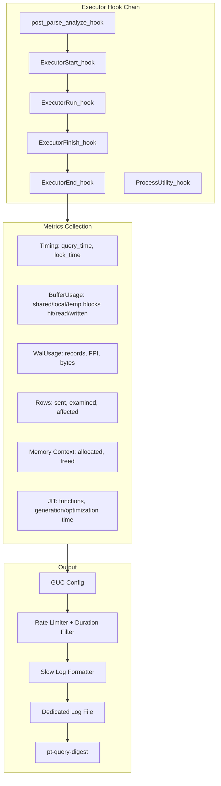

# pg_enhanced_query_logging Extension

## Architecture Overview

A C-based PostgreSQL extension loaded via `shared_preload_libraries` that hooks into the executor pipeline to capture query execution metrics and writes them to a dedicated log file in MySQL slow query log format, compatible with `pt-query-digest --type slowlog`.




## Language and Tooling

- **Language:** C (same as PostgreSQL core; zero overhead, direct access to all internal APIs)
- **Build:** PGXS (standard PostgreSQL extension build system)
- **Testing:** pg_regress (SQL regression tests) + TAP tests (Perl, for log file output verification)
- **File I/O:** PostgreSQL's `AllocateFile()`/`FreeFile()` for managed file handles

## File Structure

```
pg_enhanced_query_logging/
  Makefile                                    # PGXS build
  pg_enhanced_query_logging.control           # Extension metadata
  pg_enhanced_query_logging--1.0.sql          # SQL stubs (reset function)
  pg_enhanced_query_logging.conf              # Test configuration
  pg_enhanced_query_logging.c                 # Main source (hooks, GUCs, formatting, I/O)
  sql/                                        # Regression tests
    01_basic.sql
    02_guc.sql
    03_filtering.sql
  expected/                                   # Expected outputs
    01_basic.out
    02_guc.out
    03_filtering.out
  t/                                          # TAP tests (log file verification)
    001_basic_logging.pl
    002_rate_limiting.pl
    003_extended_metrics.pl
  README.md                                   # Full documentation
```

## Output Format (pt-query-digest compatible)

Minimum compatible output (always emitted):

```
# Time: 2026-02-27T14:30:00.123456Z
# User@Host: alice[alice] @ 192.168.1.10 []
# Query_time: 0.523411  Lock_time: 0.000102  Rows_sent: 42  Rows_examined: 15000
SET timestamp=1772147400;
SELECT * FROM orders WHERE status = 'pending';
```

Extended output (when `peql.log_verbosity = 'full'`), using the `Key: Value` convention that pt-query-digest auto-parses:

```
# Time: 2026-02-27T14:30:00.123456Z
# User@Host: alice[alice] @ 192.168.1.10 []
# Thread_id: 12345  Schema: mydb.public  Last_errno: 0  Killed: 0
# Query_time: 0.523411  Lock_time: 0.000102  Rows_sent: 42  Rows_examined: 15000  Rows_affected: 0
# Bytes_sent: 4096
# Shared_blks_hit: 128  Shared_blks_read: 42  Shared_blks_dirtied: 0  Shared_blks_written: 0
# Local_blks_hit: 0  Local_blks_read: 0  Local_blks_written: 0
# Temp_blks_read: 0  Temp_blks_written: 0
# Shared_blk_read_time: 0.001234  Shared_blk_write_time: 0.000000
# WAL_records: 0  WAL_bytes: 0  WAL_fpi: 0
# Plan_time: 0.002100
# Full_scan: Yes  Temp_table: No  Temp_table_on_disk: No  Filesort: No  Filesort_on_disk: No
# Log_slow_rate_type: query  Log_slow_rate_limit: 10
SET timestamp=1772147400;
SELECT * FROM orders WHERE status = 'pending';
```

Naming conventions are chosen so that keys ending in `_time` are parsed as float/time metrics by pt-query-digest, `Yes`/`No` values as booleans, and everything else as integers -- matching the parser's `(\w+): (\S+)` regex.

## GUC Configuration Variables

All prefixed with `peql.` (short for pg_enhanced_query_logging):


| GUC                                   | Type     | Default         | Context | Description                                        |
| ------------------------------------- | -------- | --------------- | ------- | -------------------------------------------------- |
| `peql.enabled`                        | bool     | true            | SUSET   | Master on/off switch                               |
| `peql.log_min_duration`               | int (ms) | -1              | SUSET   | Minimum query time to log (-1 = disabled, 0 = all) |
| `peql.log_directory`                  | string   | ""              | SIGHUP  | Override log dir (empty = use PG log_directory)    |
| `peql.log_filename`                   | string   | "peql-slow.log" | SIGHUP  | Log file name                                      |
| `peql.log_verbosity`                  | enum     | standard        | SUSET   | `minimal`, `standard`, `full`                      |
| `peql.log_utility`                    | bool     | false           | SUSET   | Log utility (DDL) statements                       |
| `peql.log_nested`                     | bool     | false           | SUSET   | Log nested statements (inside functions)           |
| `peql.rate_limit`                     | int      | 1               | SUSET   | Log every Nth query/session (1 = all)              |
| `peql.rate_limit_type`                | enum     | query           | SUSET   | `session` or `query`                               |
| `peql.rate_limit_always_log_duration` | int (ms) | 10000           | SUSET   | Duration threshold that bypasses rate limit        |
| `peql.rate_limit_auto_max_queries`    | int      | 0               | SUSET   | Max queries/second to log (0 = unlimited)          |
| `peql.rate_limit_auto_max_bytes`      | int      | 0               | SUSET   | Max bytes/second written to log (0 = unlimited)    |
| `peql.track_io_timing`                | bool     | true            | SUSET   | Track block read/write times                       |
| `peql.track_wal`                      | bool     | true            | SUSET   | Track WAL usage                                    |
| `peql.track_memory`                   | bool     | false           | SUSET   | Track memory context usage (experimental)          |
| `peql.track_planning`                 | bool     | false           | SUSET   | Track planning time separately                     |
| `peql.log_parameter_values`           | bool     | false           | SUSET   | Log bind parameter values                          |
| `peql.log_query_plan`                 | bool     | false           | SUSET   | Include EXPLAIN output in log                      |
| `peql.log_query_plan_format`          | enum     | text            | SUSET   | EXPLAIN format: `text`, `json`                     |


## Implementation Details

### Hook Chain

The extension installs hooks in `_PG_init()`, chaining with any previously installed hooks:

- `**post_parse_analyze_hook**`: Capture query ID (for fingerprinting)
- `**ExecutorStart_hook**`: Snapshot `pgBufferUsage`/`pgWalUsage` baselines; enable `INSTRUMENT_ALL` on the `QueryDesc`; record start timestamp
- `**ExecutorRun_hook**`: Pass through (chain only)
- `**ExecutorFinish_hook**`: Pass through (chain only)
- `**ExecutorEnd_hook**`: Compute deltas for all metrics; apply duration filter + rate limiter; format and write log entry
- `**ProcessUtility_hook**`: Same pattern for DDL/utility statements (controlled by `peql.log_utility`)

### Rate Limiting

Implements the Percona Server rate limiting model:

- **Session mode** (`peql.rate_limit_type = 'session'`): On backend startup, generate `random() % rate_limit`; if 0, this session is a "logged session" and logs everything. Stored in a `static bool` per backend.
- **Query mode** (`peql.rate_limit_type = 'query'`): For each query, generate `random() % rate_limit`; if 0, log it.
- **Always-log override**: Queries exceeding `peql.rate_limit_always_log_duration` bypass the rate limiter entirely.
- Rate limit metadata (`Log_slow_rate_type`, `Log_slow_rate_limit`) is included in the log entry so pt-query-digest can weight sampled data.

### File I/O Strategy

- Use `AllocateFile()` with `O_WRONLY | O_CREAT | O_APPEND` and `FreeFile()` for managed handles
- Construct path: if `peql.log_directory` is empty, use `Log_directory` (from `postmaster/syslogger.h`); resolve relative paths against `DataDir`
- Each backend opens/appends/closes the file per log entry (safe for concurrent access with `O_APPEND` on POSIX)
- StringInfo buffer is built in a temporary memory context, then written in a single `fwrite()` call for atomicity

### Metrics Mapping (PostgreSQL to Slow Log Fields)


| Slow Log Field                        | PostgreSQL Source                                                                                | Verbosity |
| ------------------------------------- | ------------------------------------------------------------------------------------------------ | --------- |
| `Query_time`                          | `Instrumentation.total`                                                                          | all       |
| `Lock_time`                           | `LWLock wait time` (if available, else 0)                                                        | all       |
| `Rows_sent`                           | `queryDesc->estate->es_processed` (SELECT)                                                       | all       |
| `Rows_examined`                       | Sum of `ntuples` across SeqScan/IndexScan nodes                                                  | all       |
| `Rows_affected`                       | `queryDesc->estate->es_processed` (DML)                                                          | all       |
| `Schema`                              | `MyProcPort->database_name.current_schema` (via `namespace_search_path` / `fetch_search_path()`) | standard+ |
| `Thread_id`                           | `MyProcPid`                                                                                      | standard+ |
| `Bytes_sent`                          | Estimated from result set                                                                        | standard+ |
| `Shared_blks`_*                       | `BufferUsage` delta                                                                              | full      |
| `Local_blks`_*                        | `BufferUsage` delta                                                                              | full      |
| `Temp_blks`_*                         | `BufferUsage` delta                                                                              | full      |
| `*_blk_read_time`/`*_blk_write_time`  | `BufferUsage` delta (if `track_io_timing`)                                                       | full      |
| `WAL_records`/`WAL_bytes`/`WAL_fpi`   | `WalUsage` delta                                                                                 | full      |
| `Plan_time`                           | Planner hook timing (if `peql.track_planning`)                                                   | full      |
| `Full_scan`                           | Check for SeqScan in plan tree                                                                   | full      |
| `Temp_table`                          | `temp_blks_written > 0`                                                                          | full      |
| `Filesort`                            | Check for Sort node in plan tree                                                                 | full      |
| `Mem_allocated`                       | `MemoryContextMemAllocated()` delta                                                              | full      |
| `JIT_functions`/`JIT_generation_time` | `JitInstrumentation`                                                                             | full      |


### SQL Interface

A minimal SQL extension provides:

- `pg_enhanced_query_logging_reset()`: Truncate/rotate the log file
- `pg_enhanced_query_logging_stats()`: Return internal counters (queries logged, queries skipped, bytes written)

## Novel Ideas Beyond Percona's Feature Set

1. **Query fingerprinting in the log**: Include PostgreSQL's `queryId` (computed by `pg_stat_statements` style jumble) as a `Query_id` field. This enables cross-referencing with `pg_stat_statements` without re-parsing queries.
2. **Plan-aware metrics**: Walk the plan tree to extract `Full_scan` (SeqScan without filter), `Filesort` (Sort node), parallel worker counts -- providing MySQL-equivalent plan quality signals from PostgreSQL's richer plan representation.
3. **Adaptive rate limiting**: A `peql.rate_limit_auto` mode that dynamically adjusts the rate limit based on two independent throttles, either or both can be active:
  - **Query throughput**: Cap at N queries/second logged (e.g., `peql.rate_limit_auto_max_queries = 100`), preventing log file explosion under load spikes.
  - **Write throughput**: Cap at N bytes/second written to the log file (e.g., `peql.rate_limit_auto_max_bytes = 2097152` for 2 MB/s). Each backend tracks its own bytes-written and a shared memory counter aggregates across all backends. When the aggregate exceeds the threshold, new entries are suppressed until the window resets. This protects disk I/O from runaway logging without disabling the feature entirely.
4. **Per-table I/O attribution**: In `full` verbosity, log which tables contributed the most buffer hits/reads, leveraging `PlanState` instrumentation per scan node.
5. **Wait event tracking**: Capture wait events during query execution (from `pg_stat_activity` wait_event infrastructure) to show what the query was waiting on (IO, Lock, LWLock, etc.), which has no MySQL equivalent.
6. **Transaction-aware logging**: Option to log at transaction boundary instead of per-statement, aggregating metrics across all statements in a transaction.

## Build and Deployment

```bash
# Build
make PG_CONFIG=/path/to/pg_config

# Install
make install PG_CONFIG=/path/to/pg_config

# Configure postgresql.conf
shared_preload_libraries = 'pg_enhanced_query_logging'
peql.log_min_duration = 100    # log queries > 100ms
peql.log_verbosity = 'full'

# Use with pt-query-digest
pt-query-digest /path/to/peql-slow.log
```

## Incremental Build Phases

The implementation will proceed in 6 phases, each producing a working, testable increment.