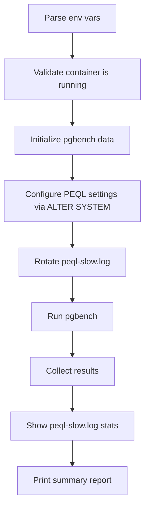

# pgbench Benchmark Script for PEQL Overhead Testing

## Goal

Create `test/run_pgbench.sh` -- a script that runs pgbench benchmarks against the PostgreSQL containers started by `deploy_docker_pg18.sh` or `deploy_docker_pg18_rhel.sh`, with configurable parameters to stress-test the extension's overhead under various concurrency/throughput scenarios.

## Target Container Detection

The script will auto-detect which container to use based on a `PEQL_CONTAINER` env var, defaulting to `peql-pg18-test`. It will reuse the same connection defaults as the deploy scripts:

- Ubuntu container: port `15432`, container `peql-pg18-test`
- RHEL container: port `15433`, container `peql-pg18-rhel-test`

## Configurable Parameters

All parameters via environment variables with sensible defaults:

### Core pgbench settings (user-requested)

- `**PEQL_BENCH_CLIENTS**` -- number of concurrent connections (default: `10`)
- `**PEQL_BENCH_DURATION**` -- runtime in seconds (default: `60`)
- `**PEQL_BENCH_MODE**` -- workload type: `read-only`, `read-write`, `write-heavy` (default: `read-write`)

### Additional pgbench settings (recommended for overhead testing)

- `**PEQL_BENCH_THREADS**` -- pgbench threads (default: number of clients, capped at nproc)
- `**PEQL_BENCH_SCALE**` -- pgbench scale factor for `pgbench -i` (default: `100`, ~1.5GB dataset)
- `**PEQL_BENCH_RATE**` -- target TPS rate limit (`0` = unlimited, default: `0`). Useful for fixed-rate latency comparison
- `**PEQL_BENCH_PROTOCOL**` -- query protocol: `simple`, `extended`, `prepared` (default: `prepared`). Tests parameter logging overhead with prepared statements
- `**PEQL_BENCH_CUSTOM_SCRIPT**` -- path to a custom pgbench script file (optional)

### PEQL extension toggle (A/B comparison)

- `**PEQL_BENCH_PEQL_ENABLED**` -- `on` or `off` (default: `on`). When set to `off`, the script disables `peql.enabled` before the benchmark, enabling before/after comparison of extension overhead
- `**PEQL_BENCH_VERBOSITY**` -- set `peql.log_verbosity` for the run: `minimal`, `standard`, `full` (default: current server setting)
- `**PEQL_BENCH_LOG_MIN_DURATION**` -- set `peql.log_min_duration` for the run (default: current server setting). Useful to test "log nothing" (`-1`) vs "log everything" (`0`) overhead

### Connection settings

- `**PEQL_PG_PORT**` -- PostgreSQL port (default: `15432`)
- `**PEQL_PG_PASSWORD**` -- password (default: `peqltest`)
- `**PEQL_PG_HOST**` -- host (default: `localhost`)

## Script Flow




1. **Pre-flight**: Validate the target container is running and PostgreSQL is accepting connections
2. **Initialize**: Run `pgbench -i -s $SCALE` inside the container (skip if already initialized, controlled by `PEQL_BENCH_INIT` flag)
3. **Configure PEQL**: Apply requested PEQL GUC overrides via `ALTER SYSTEM` + `pg_reload_conf()`
4. **Reset log**: Call `pg_enhanced_query_logging_reset()` to start with a clean log
5. **Run benchmark**: Execute pgbench with all configured parameters. Capture output to a timestamped results file
6. **Collect metrics**: After the run, report:
  - pgbench TPS (including/excluding connection setup)
  - Average latency and stddev
  - PEQL log file size and entry count
  - `pg_enhanced_query_logging_stats()` output (queries logged/skipped/bytes)
7. **Summary**: Print a formatted report with all settings and results

## Workload Modes


| Mode          | pgbench flags                              | Purpose                                         |
| ------------- | ------------------------------------------ | ----------------------------------------------- |
| `read-only`   | `pgbench -S` (select-only)                 | Measure overhead on pure SELECT workload        |
| `read-write`  | `pgbench` (default TPC-B)                  | Standard mixed workload                         |
| `write-heavy` | Custom script with INSERT/UPDATE-heavy mix | Stress WAL metrics and buffer tracking overhead |


For `write-heavy`, the script will use a built-in custom pgbench script that does multiple INSERTs and UPDATEs per transaction.

## Output

Results are printed to stdout and optionally saved to a file under `test/bench_results/` (timestamped). The report includes:

- All configuration parameters used
- pgbench raw output (TPS, latency)
- PEQL stats (queries logged, skipped, bytes written)
- Log file size

## Key Files

- **New**: `[test/run_pgbench.sh](test/run_pgbench.sh)` -- the benchmark script (~250-300 lines)
- **Existing**: `[test/deploy_docker_pg18.sh](test/deploy_docker_pg18.sh)` -- Ubuntu container (port 15432)
- **Existing**: `[test/deploy_docker_pg18_rhel.sh](test/deploy_docker_pg18_rhel.sh)` -- RHEL container (port 15433)

## Usage Examples

```bash
# Quick baseline: 10 clients, 60s, read-write, PEQL on
./test/run_pgbench.sh

# Heavy concurrency test
PEQL_BENCH_CLIENTS=100 PEQL_BENCH_DURATION=300 ./test/run_pgbench.sh

# A/B comparison: run with PEQL off, then on
PEQL_BENCH_PEQL_ENABLED=off ./test/run_pgbench.sh
PEQL_BENCH_PEQL_ENABLED=on PEQL_BENCH_VERBOSITY=full ./test/run_pgbench.sh

# Read-only at fixed rate for latency comparison
PEQL_BENCH_MODE=read-only PEQL_BENCH_RATE=5000 PEQL_BENCH_CLIENTS=50 ./test/run_pgbench.sh

# Test against RHEL container
PEQL_PG_PORT=15433 ./test/run_pgbench.sh

# Write-heavy with prepared protocol (tests parameter value logging overhead)
PEQL_BENCH_MODE=write-heavy PEQL_BENCH_PROTOCOL=prepared ./test/run_pgbench.sh

# Extreme: 200 clients, full verbosity, log everything, 5 minutes
PEQL_BENCH_CLIENTS=200 PEQL_BENCH_DURATION=300 PEQL_BENCH_VERBOSITY=full \
  PEQL_BENCH_LOG_MIN_DURATION=0 ./test/run_pgbench.sh
```

